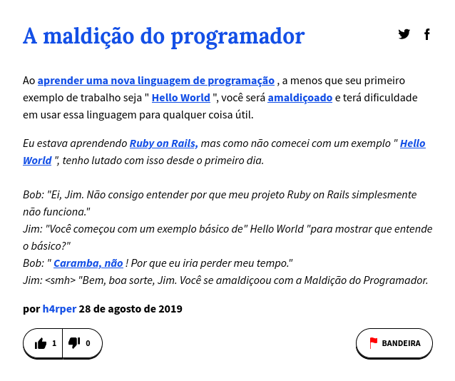

# A Maldição do Programador

Existe uma lenda muito antiga entre os programadores que teria surgido quando os criadores de C criaram o primeiro manual da linguagem que quando um programador está aprendendo uma nova linguagem de programação seu primeiro programa deve imprimir "Olá Mundo!" na tela, caso contrário o programador que não fizer isso vai atrair todo o azar para seu aprendizado, todos seus programas vão ter erros e todos os softwares que escrever nessa linguagem serão cheios de bugs e falhas.

<br>
<p align="center">
    
    <p align="center">Explicação retirada e traduzida de <a href="https://www.urbandictionary.com/define.php?term=programmers%20curse">Urban Dictionary</a>.</p>
</p>
<br>

Para evitar que isso aconteça com a linguagem que você está aprendendo é necessário que você aprenda a imprimir mensagens na tela.

## Programação

```
Para se livrar da terrível maldição do programador você deve escrever um programa que escreve as palavras "Olá mundo!" na tela. 

Entradas:
- Nenhuma

Saída:
- Mensagem "Olá Mundo!"
```