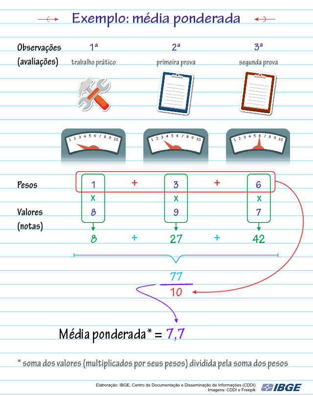

# Média

## O que é uma Média

Todos nós em algum momento da nossa vida tivemos que ser avaliados de alguma forma por uma **Média**, geralmente na escola durante o Ensino Básico e/ou Médio temos um boletim que descreve nossas notas e também nossas médias. 

A Média fornece um indicador que pode representar, em certas circunstâncias, os dados de uma pesquisa e também é a base para o cálculo de outras medidas tais como o desvio padrão, coeficiente de variação, de correlação, dentre outras.

A média é muito utilizada na estatisca em alguns casos:
- Para estimar uma quantidade desconhecida na presença de erros de medição, que é a diferença entre o valor indicado e o verdadeiro valor medido;
- Para obter um valor justo/eqüitativo para uma distribuição uniforme, ou seja, dos valores que tem a mesma chance de ocorrer em um intervalo;
-  Para servir de elemento representativo de um conjunto de dados, cuja distribuição é simétrica – quando coincidem os valores da média, da moda e da mediana;
- Para obter um valor mais provável quando aleatoriamente tomamos um elemento de uma população;
- Para ser uma boa estimativa para a média de uma população;
- Para ser uma estimativa da variável para tempo futuro.

## Na Matemática

### Média Aritmética Simples

A Média Aritmética será chamada de Média Aritmética Simples quando for calculada como o quociente entre a soma de todos os valores do conjunto e o número de elementos que esse conjunto possui.

**Por exemplo**:

Em uma família, de quatro pessoas, a idade do pai é 40, da mãe é 36, do filho é 10 e da filha é 14. Então, qual é a média entre os valores relacionados?

O primeiro passo é somar todos os valores, ou seja:

40 + 36 + 14 + 10 = 100

E agora dividir o resultado pelo número de elementos que esse conjunto possui, nesse caso pai, mãe, filho e filha são 4 elementos.

100 / 4 = 25

### Média Aritmética Ponderada

Ela será chamada de Média Aritmética Ponderada quando alguns valores possuírem mais importância (peso) do que outros. Essa relevância é indicada por um numeral denominado peso.

Neste caso, encontraremos a Média Aritmética Ponderada dividindo o somatório dos produtos dos valores por seus respectivos pesos pela soma dos pesos.

**Por exemplo**:

Em um curso de mecânica, a nota final é obtida após a conclusão de um trabalho prático e duas provas. Mas a organização do curso acha melhor considerar cada prova com diferentes relevâncias. Cada relevância será indicada por um número chamado de peso.

Suponhamos que você esteja fazendo esse curso, então no decorrer do curso você fará um trabalho prático, uma prova com peso 3 e outra prova com peso 6.

No trabalho sua nota foi 8. Na primeira prova sua nota foi 9 e na segunda prova sua nota foi 7.

Então, os valores são: 8 (do trabalho), 9 (da segunda nota que possui peso 3) e 7 (da terceira nota que possui peso 6).

Observação: no caso dos valores que não possuem pesos atribuídos, subentende-se que o peso seja 1.

Confira o cálculo da média ponderada na animação a seguir:

<p align="center">
    
</p>

### Tanto para a Média Aritmética Simples quanto para a Ponderada

- A média está localizada entre os valores extremos (valor mínimo e valor máximo)

| Minimo | < | Média | < | Máximo |
|--------|---|-------|---|--------|
| 10     | < | 25    | < | 40     |

- A soma dos desvios a partir da média é zero
O desvio significa a diferença entre o valor e a média. Mas devemos considerar a posição que a média ocupará no conjunto de valores, após estiverem ordenados:
    - Assim, os desvios são: (10 - 25), (14 - 25), (36 - 25) e (40 - 25).
    - Somando os desvios: - 15 - 11 + 11 + 15 = 0.
- A média é influenciada por cada um e por todos os valores;
- A média não necessariamente coincide com um dos valores que a compõem;
- A média pode ser um número que não tem um correspondente na realidade física (por exemplo, em 2000 a mulher brasileira tinha, em média, 2,3 filhos;
- O cálculo da média leva em consideração todos os valores, inclusive os nulos e os negativos;
- A média é um valor representativo dos dados a partir dos quais ela foi calculada;
- Em termos espaciais, a média é o valor que está mais próximo de todos os valores.

##### Texto Adaptado do Site do [IBGE](https://educa.ibge.gov.br/professores/educa-recursos/17862-media-pagina-inicial.html)

## Programação
``` 
Imagine que vários desenvolvedores de software que trabalham com front-end 
publicaram abertamente seus salários no Twitter e você gostaria de fazer um programa 
que calculasse a média de salários de cada região a partir do input de 3 salários dessa região.

Entradas:
- Valor float do primeiro salário
- Valor float do segundo salário
- Valor float do terceiro salário

Saída:
- Valor float da média aritmética simples
```
**Dicas**:
- Cuide a precedência das operações.
- Lembre-se que quando lemos as entradas elas strings e precisamos convertê-las em floats.
- Não se preocupe caso o resultado exiba muitos números após a vírgula, é normal que os números decimais saiam assim, vamos aprender a formatar esses números mais para frente.