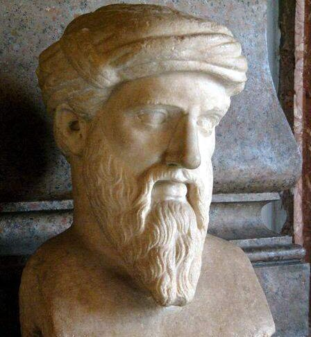
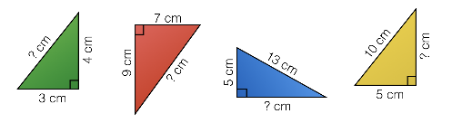
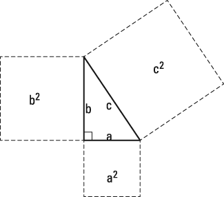
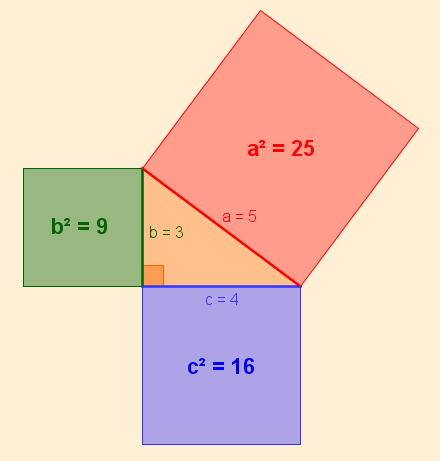
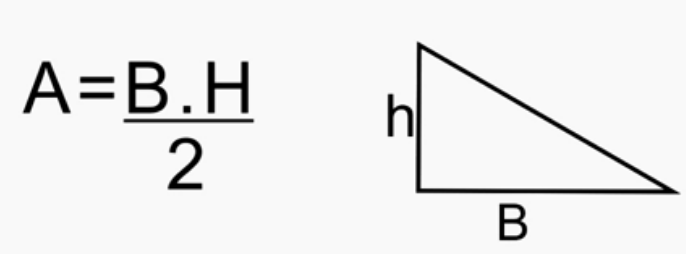

# Pitágoras

## Um pouco de história

Pitágoras de Samos foi um filósofo, sábio, matemático e geômetra Grego. Ele nasceu na Ilha de Samos, por volta de 570 a.C. e desde muito novo recebeu educação dos melhores professores ao redor do mundo tendo estudado nos melhores centros de ensino da Grécia, Egito, Babilônia, Síria, Fenícia,  Pérsia e Índia. Pitágoras teve inúmeras contribuições para a Filosofia e a Matemática, mas talvez a mais importante entre elas foi justamente ele ter sido o criador do nome desses campos de estudo quando criou o Curso de Filosofia (onde estudava-se sobre o saber e o conhecimento) e o Curso de Matemática (onde estudava-se sobre o método de formalização do aprendizado) na sua Escola Pitagórica, que seria como uma Universidade de seu tempo.

<p align="center">
    
    <p align="center">Busto de Pitágoras.</p>
</p>

A Escola Pitagórica fez inúmeras descobertas como os intervalos musicais, provas de que a Terra é esférica, a seção áurea, os números perfeitos e os primeiros tratados de Geometria que estudaram os Sólidos de Platão. Porém, quando falamos de Pitágoras talvez a primeira coisa que nos veem a cabeça é a lembrança do Teorema que se estuda principalmente no Ensino Médio, onde foi definido por Pitágoras que:

> Em qualquer triângulo retângulo (aquele que possui um ângulo de 90º), a área do quadrado da hipotenusa (o lado oposto ao ângulo de 90º) é igual a soma da área dos catetos (os outros 2 lados).

Apesar de Pitágoras de fato ter formulado o Teorema e ser o responsável por disseminar o conhecimento sobre essa relação no Ocidente, acreditasse que ele tenha apreendido em suas viagens de estudo pelo Oriente onde ela já era conhecida a milênios. Os primeiros registros dessa descoberta são Babilônicos e datam mais de um milênio antes do nascimento de Pitágoras, além disso existem registros na China e na índia que também antecedem Pitágoras (acreditasse provavelmente que através de conhecimento levado pelos Babilônicos).

## Vamos a Matemática

Isso pode parecer abstrato, mas vamos por partes:

1. Imagine que você tem um triângulo retângulo qualquer em que você saiba apenas duas dimensões.

<p align="center">
    
</p>

2. Um quadrado é uma figura com 4 lados de mesmo tamanho, então vamos imaginar que vamos transpor cada um dos lados do triangulo retângulo em quadrados.

<p align="center">
    
</p>
   
3. A área de um quadrado é dado por seu lado vezes a si mesmo, ou lado², então a área de cada um desses quadrados é o valor do lado que transpomos ao quadrado.
4. Então Pitágoras observou que a área do quadrado maior **sempre** é do tamanho da soma dos outros dois.

<p align="center">
    
</p>

5. Dados isso, chegamos a fórmula que os <u>lados</u> da **hipotenusaª = catetoª + cateto²**, mais conhecido como **a² = b² + c²**.  

Essa observação tem sido colocado a prova a milênios, sendo que outras personalidades como Da Vinci, Euler e Einstein também escreveram diferentes provas que confirmam que essa é uma relação real.

## Programação

```
Você deve desenvolver um algoritmo que calcule a área do triângulo (fórmula abaixo), o tamanho da hipotenusa e as áreas dos quadrados do triângulo retângulo.

Entradas:
- Valor float de Altura
- Valor float de Base

Saída:
- Valor do tamanho da hipotenusa
- Valor do área do quadrado da hipotenusa
- Valor da área do quadrado da altura
- Valor da área do quadrado da base
- Valor do tamanho do triângulo
``` 

**dicas**:
- Comece calculando as áreas dos quadrados e use-os para encontrar o valor da hipotenusa.
- Você pode passar a exponenciação para o outro lado da igualdade como sua operação inversa (raíz).
- Operações Matemáticas com Float (números decimais) não são exatas, e por tanto provavel que o valor da soma dos quadrados seja aproximadamente o quadrado da hipotenusa, mas não exato. Isso é um problema característico de linguagens de programação, não se preocupe se não for exato.
- A área do triangulo é calculada com a seguinte fórmula:

<p align="center">
    
</p>
