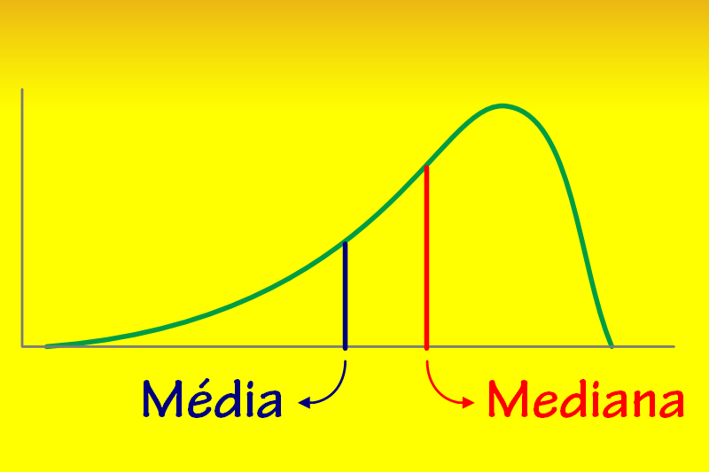

# Mediana

## O que é uma mediana?

    

Na estatística a Mediana é o elemento que indica o valor médio em um conjunto de números ordenados. Essa medida indica qual valor que está exatamente no meio de um conjunto de dados ordenados.

A Mediana nos diz que 50% (1/2) dos valores estão abaixo de seu valor e a outra metade está acima deste. Quando os conjuntos possuem um número ímpar de elementos a Mediana é o elemento que está ao meio, porém quando o conjunto possuí um número par de elementos a mediana é a média dos dois elementos centrais deste conjunto.

A principal vantagem da mediana em relação a média é que a mediana pode retornar um valor central sem ser tão distorcida quando valores extremamente altos ou baixos estão presentes no conjunto.

## História

A ideia de mediana aparece primariamente em um livro religioso o Talmude que é uma coletânea de livros sagrados da Religião Judaica. Porém, os Judeus utilizavam o método da mediana porén ainda sem um nome ou uma formalização sobre como utlizá-la fora das aplicações financeiras.

    
    
Pierre Simon Laplace, primeiro a formalizar a Mediana.

Foi somente em 1774 que o matemático francês Pierre Laplace o primeiro a formalizar o cálcula da mediana que em seu tempo foi ignorado por ser visto como redundante em sua época já que havia outros cálculos capazes de determinar tendências centrais.

    
    
Gustav Fechner, responsável por popularizar o uso da Mediana.

Porém com o tempo mais e mais aplicações do uso da mediana surgiram tanto na Matemática, quanto na Astronomia, Física e Economia. Quase um século após Laplace ter formalizado a fórmula da mediana ela se tornou popular pela advocacia de outro matemático alemão: Gustav Fechner, que popularizou a importância do uso da Mediana na análise de dados onde é muito popular até os dias de hoje.

## Na Matemática

### Percentis

#### Texto Adaptado do Site do [IBGE](https://educa.ibge.gov.br/professores/educa-recursos/17862-media-pagina-inicial.html)

## Programação